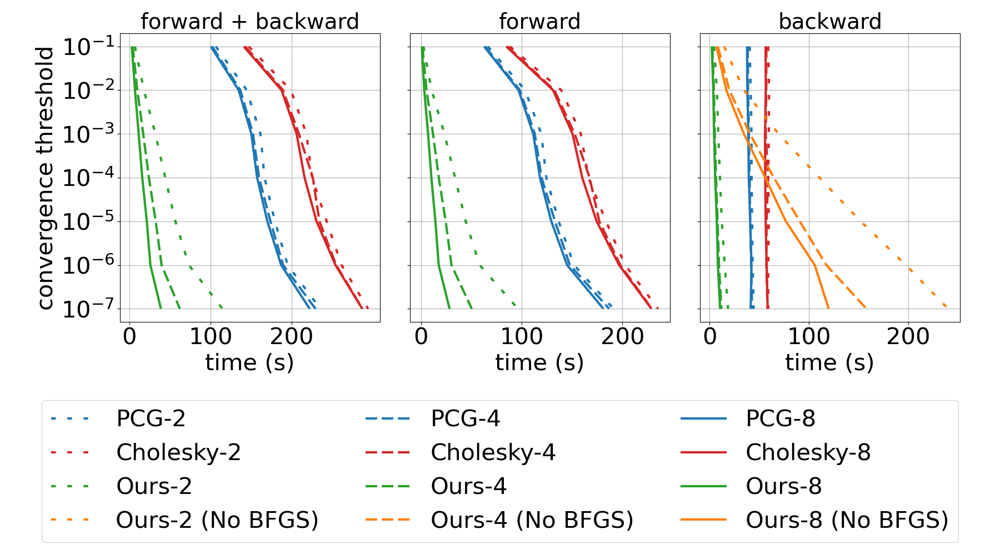

# Differentiable Projective Dynamics

[](https://travis-ci.com/mit-gfx/diff_pd)

## Recommended systems
- Ubuntu 18.04
- (Mini)conda 4.7.12 or higher
- GCC 7.5 (Other versions might work but we tested the codebase with 7.5 only)

## Installation
```
git clone --recursive https://github.com/mit-gfx/diff_pd.git
cd diff_pd
conda env create -f environment.yml
conda activate diff_pd
./install.sh
```
If you would like to enable multi-threading, set the thread_ct in the options object in the python script. The examples below all use a default of 8 threads for parallel processes. Using 1 will force the program to run sequentially.

## Examples
Navigate to the `python/example` path and run `python [example_name].py` where the `example_name` could be the following:

### Display
- `render_hex_mesh` explains how to use the external renderer (pbrt) to render a 3D hex mesh.
- `render_quad_mesh` explains how to use matplotlib to render a 2D quad mesh.

### Numerical check
- `state_force_2d` and `state_force_3d` test the implementation of state-based forces (e.g., friction, hydrodynamic force, penalty force for collisions) and their gradients w.r.t. position and velocity states.
- `pd_energy_2d` and `pd_energy_3d` test the implementation of vertex-based and element-based projective dynamics energies.
- `actuation_2d` and `actuation_3d` test the implementation of the muscle model.
- `pd_forward` verifies the forward simulation of projective dynamics by comparing it to the solutions from Newton's method.
- `deformable_backward_2d` uses central differencing to numerically check the gradients in Newton-PCG, Newton-Cholesky, and PD methods. A 2D rectangle is simulated with some fixed boundary conditions and a random but constant external force for 1 second at 30 fps. The loss is defined as a weighted sum of the final position and velocity and the gradients are computed by back-propagation.
- `deformable_backward_3d` tests the forward simulation and back-propagation in 3D with three methods (Newton-PCG, Newton-Cholesky, and PD) and with dirichlet boundary conditions, gravity, and collisions. `deformable_backward_3d` also plots the loss and magnitude of the three methods against the relative tolerance that was used to compute them.
- `collision_2d` compares the forward and backward implementation of collision models in Newton's methods and PD.

### Quasi-static solvers
- `deformable_quasi_static_3d` solves the quasi-static state of a 3D hex mesh. The hex mesh's bottom and top faces are fixed but the top face is twisted.

### Demos
#### Sec. 6.1
- `landscape_3d.py` and `print_landscape_3d_table.py`: generate Fig. 1 of the paper.

#### Sec. 6.2
- `benchmark_3d.py` and `print_benchmark_3d_table.py`: generate Figs. 2 and 3 of the paper.

- `rolling_jelly_3d.py` and `print_rolling_jelly_3d_table.py`: generate Figs. 4 and 5 of the paper.

- `render_benchmark_3d.py`: generate mesh data for the `Benchmark` video.
- `render_rolling_jelly_3d.py`: generated mesh data for the `Rolling sphere` video.

#### Sec. 7.1
**Cantilever**
Note that the `Cantilever` example is deprecated and not included in the paper.
- `cantilever_3d.py`: run the `Cantilever` example on GCP (Google Cloud Platform).
- `render_cantilever_3d.py`: generate mesh data for the `Cantilever` video.

**Plant**
- `plant_3d.py`: run the `Plant` example on GCP.
- `print_plant_3d.py`: generate data for Table 3 and Fig. 1 in supplemental material.
- `render_plant_3d.py`: generate mesh data for the `Plant` video.

**Bouncing ball**
- `bouncing_ball_3d.py`: run the `Bouncing ball` example on GCP.
- `print_bouncing_ball_3d.py`: generate data for Table 3 and Fig. 2 in supplemental material.
- `render_bouncing_ball_3d.py`: generate mesh data for the `Bouncing ball` video.

#### Sec. 7.2
**Bunny**
- `bunny_3d.py`: run the `Bunny` example on GCP.
- `print_bunny_3d.py`: generate data for Table 3 and Fig. 3 in supplemental material.
- `render_bunny_3d.py`: generate mesh data for the `Bunny` video.

**Routing tendon**
- `tendon_routing_3d.py`: run the `Routing tendon` example on GCP.
- `print_tendon_routing_3d.py`: generate data for Table 3 and Fig. 4 in supplemental materal.
- `render_tendon_routing_3d.py`: generate mesh data for the `Routing tendon` video.

#### Sec. 7.3
**Torus**
- `torus_3d.py`: run the `Torus` example on GCP.
- `render_torus_3d.py`: generate mesh data for the `Torus` video.

**Quadruped**
- `quadruped_3d.py`: run the `Quadruped` example on GCP.
- `render_quadruped_3d.py`: generate mesh data for the `Quadruped` video.

**Cow**
- `cow_3d.py`: run the `Cow` example on GCP.
- `render_cow_3d.py`: generate mesh data for the `Cow` video.

#### Sec. 7.4
Examples in this section require non-trivial setup of deep reinforcement learning pipelines, so it is not included in the master branch.